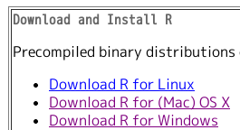
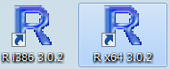

--- 
title       : 因子分析大作戦
subtitle    : とある弁当屋の統計技師(データサイエンティスト) 2
author      : 石田基広
job         : 
framework   : io2012        # {io2012, html5slides, shower, dzslides, ...}
highlighter : highlight.js  # {highlight.js, prettify, highlight}
hitheme     : tomorrow      # 
widgets     : []            # {mathjax, quiz, bootstrap}
mode        : selfcontained # {standalone, draft}

--- &logo

## はじめに 

*** left 

本サイトは『とある弁当屋のデータサイエンティスト2 -- 因子分析大作戦--』共立出版のサポートサイトです。

なお以降のページからこのページ(目次)に戻るには美咲の画像をクリックします

*** right

### コンテンツ

1. Rのインストールと使い方
2. 本書のサポートパッケージのインストールと使い方
3. 因子分析入門
4. 検定

--- &nologo

## Rのインストールと使い方

*** left 
- Rはフリーの統計解析ソフトウェアです
- まずは[ここからダウンロード](http://cran.ism.ac.jp/)しましょう
- 利用されているOSごとにリンクをたどります

*** right 

- インストールはダブルクリックするだけです．なにも考えず「次へ/OK」を押していきましょう

--- &logo

## 使ってみる

*** left

- Windowsの場合はデスクトップにRとデザインされたアイコンが現われます．二つある場合どっちを使っても構いません

- Macの場合は「アプリケーション」フォルダにRアイコンがあります

*** right

- 起動するとRconsoleという画面が現われます
- 画面の > の右に命令を指示します
- 例としてpiと入力してEnterを押しています

--- &logo

## 本書のパッケージを導入

*** left 

それでは，本書の内容をRで確認できるパッケージを導入します

Rのコンソールで>の右に次のように入力してEnterを押します

    install.packages("Misaki",repos="http://rmecab.jp/R")

*** right

<!-- 実行すると「CRANのサイトを選べ」というダイアログが表示されます -->

<!-- 三つあるJapanから一つを選んでOKを押します -->

「パッケージ用のフォルダを作成するか？」と尋ねられたらOKを押します

実行後，R コンソールで以下のように入力してEnterを押すと，パッケージが利用できるようになります
(Misakiパッケージをロードすると言います)

    library (Misaki)

Rを起動して，本書付録パッケージを利用する場合は，最初にこの命令を1回実行します(入力してEnterをおします)

--- &logo

## 本書のパッケージの利用

*** left

Rを起動し，Misakiパッケージをロードしたら，次のように実行すると，各章に対応した内容が表示されます

    demo(chap1)
    
あとは画面の指示通りに操作していきましょう

ちなみ2章の内容であれば次のように実行します

    demo(chap2)

3章以降についても，数字の部分を変更して実行します

*** right

### 以上でRと本書パッケージの導入は完了です

各章の内容については，[ここ](http://rmecab.jp/misaki)を参照してください

<!-- 最後にこのスライドもRで作成しています -->

<!-- slidifyとknitrというRの機能を使っています -->

--- &twocol2 bg:yellow

*** left

this is [link to slide1](#1)

this is [link to slide2](#2)

*** right

<!-- --- &anchor -->

<!-- *** left  -->

<!-- [目次に戻る](#2) -->

<!-- *** right  -->

<!-- http://masaboo.cside.com/new_css1/cs_menu.html -->
<!-- 
(shell-command "Rscript ~/Projects/R/Markdown/slidify.R")
-->
